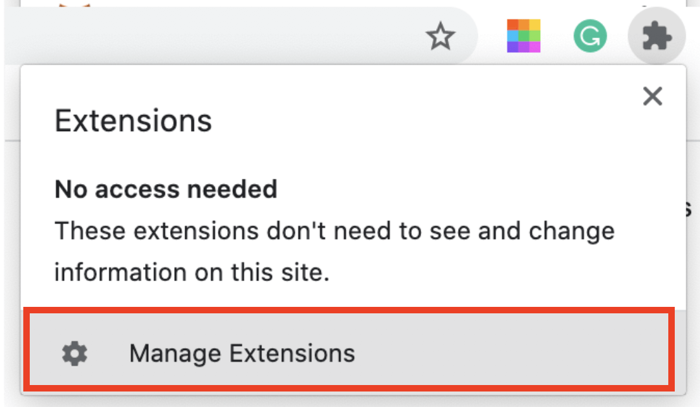
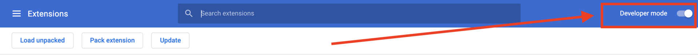
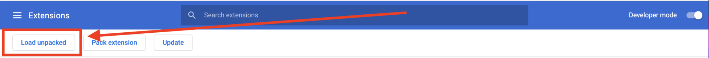

# Chrome 插件钱包安装指南
1、下载 Chrome 插件钱包

2、解压已下载的包

3、下载谷歌 Chrome 浏览器（ [https://www.google.cn/chrome/](https://www.google.cn/chrome/) ）。下载成功并安装谷歌 Chrome 浏览器。

4、打开 Chrome 浏览器并单击右上角的“扩展程序”

 
5、点击 ”管理扩展程序“

 
6、点击右上角，开启“开发者模式”

 
7、点击“加载已解压的扩展程序”，选择之前解压好的 Chrome 插件钱包，添加成功后即可开始使用。

 
8、添加成功后可以在右上角看到 Chrome 插件钱包按钮/或点开“扩展程序”中可以找到Chrome插件钱包。

 
 
**风险提示**  
Lambda 钱包为去中心化钱包，用户的所有信息都保存在用户的浏览器里由用户自己留存，并不保存在Lambda钱包数据库中，钱包已下载成功的用户（包括Lambda主网钱包），以免资产受损，请务必备份好助记词，只有备份好助记词，才会在新下载的App中找回自己的资产与数据；如果没有备份助记词，任何方式都无法帮你找回资产。