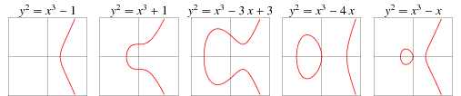

### **PDP 简介**

#### **背景知识 : 椭圆曲线（[Elliptic curve](http://mathworld.wolfram.com/EllipticCurve.html)）**

- 一类曲线

- 一种“乘法“

曲线上特殊的算术定义，可参考[讲稿](https://ecc2017.cs.ru.nl/slides/ecc2017school-castryck.pdf)

#### **背景知识 : 椭圆曲线（续）**

- 动态图示

#### **背景知识 : 椭圆曲线加密（[Elliptic-curve cryptography 1](https://en.wikipedia.org/wiki/Elliptic-curve_cryptography)）**

- 一篇论文

1985 年 Victor S.Miller 在 CRYTPO 会议上发表了 [*Use of Elliptic Curves in Cryptography*](https://link.springer.com/chapter/10.1007/3-540-39799-X_31)

- 一个难题

已知：曲线上的点g及g^x, 求 x

*（下图例展示了 97 次“乘法”所得到的结果点阵）*

#### **背景知识 : 椭圆曲线加密（续）**

- 图示解释

实现上，一般使用曲线 进行计算。且通常参与计算的 a、b、x 和 y 均取不大于 p 的整数。

#### **背景知识 : ECC 应用场景**

*设想 Alice（持有 a） 和 Bob（持有 b） 试图对一份共识进行签名*

1. 将共识内容映射为曲线上一点 g
2. Alice 公布 g^a 作为签名
3. Bob 公布 g^b 作为签名
4. 双方都计算 g^ab 并存留元组 作为本次共识签名的凭证

*(* ***注*** *：假设计算过程都是透明可信的)*

*Bob 可以抵赖吗？*

#### **背景知识 : 应用场景拓展**

*设想 Alice（持有 a）、Bob（持有 b）和 Chris（持有 c）试图对一份共识签名*

1. 将共识内容映射为曲线上一点 g
2. Alice 公布 g^a 作为签名
3. Bob 公布 g^b 作为签名
4. Chris 公布 g^c 作为签名

…… 然后呢？可能根据以上信息计算 g^abc 吗？

*可以简单地拓延 2 方签名模式吗？*

1. 仅仅保存 能够保护 Alice 吗？
2. 核心问题在哪？

#### **背景知识 : 应用场景拓展（续）**

*再来点数学*

[Pairing](https://en.wikipedia.org/wiki/Pairing) 是[抽象代数](https://zh.wikipedia.org/wiki/抽象代数)中描述一类[双线性映射](https://en.wikipedia.org/wiki/Bilinear_map)的概念。

Pairing 映射函数 的双线性特性能够保证等式  的成立。

*回到三方共识签名场景*

1. 三方都计算 并保留元组  作为本次共识签名的凭证

*现在，Bob 和 Chris 可以串通抵赖吗？*

### PDP 方案: 应用场景

#### **描述**

- Alice 要求 Bob 记忆一组信息
- Alice 本身并不会记下这组信息
- Alice 请 Chris 来确认 Bob 是否还记得这组信息
- Chris 并不了解这组信息的内容

#### **代换角色**

- Alice 即 用户
- Bob 即 存储矿工
- Chris 即 第三方审核者（以下简称 TPA）

#### **深入内容：近代数学观念**

- 两套体系

[欧式几何](https://en.wikipedia.org/wiki/Euclidean_geometry) 与 [非欧几何](https://en.wikipedia.org/wiki/Non-Euclidean_geometry) 的差异点：

[第五公理](https://en.wikipedia.org/wiki/Parallel_postulate)（或称 *第五公设* 、 *平行公设* ）

什么是“公理”（axiom 或 postulate）？

#### **深入内容：近代数学观念（续）**

- 近代数学视角

如果认可一组 **公理** ，即可应用一套体系中的结论

典型的体系即为 **抽象代数**

- 一种类似的描述

如果符合一些环境要求，即可使用库提供的功能

#### **深入内容：从数学到密码学**

大数质因子分解问题 => RSA 加密方案

（ **注意** ：[黎曼猜想](https://en.wikipedia.org/wiki/Riemann_hypothesis)和[量子筛法](https://en.wikipedia.org/wiki/Shor's_algorithm)正从两个方向对这一问题发起挑战）

[离散对数](https://en.wikipedia.org/wiki/Discrete_logarithm)问题 => ECC 加密方案

（ **注** ：实际上，ECC 是直接基于 [Diffie-Hellman 问题](https://en.wikipedia.org/wiki/Diffie–Hellman_problem) 的，只是两个问题在数学上可视为等价）

#### **深入内容：椭圆曲线加密**

- 标准阐释

[NIST FIPS 186](https://csrc.nist.gov/publications/detail/fips/186/4/final)(目前处于第四稿公示阶段) 标准第六章对基于椭圆曲线的电子签名进行了阐释，并在附录 D 章节推荐了 5 类椭圆曲线的构成参数。

golang 标准库 [crypto/elliptic](https://golang.org/pkg/crypto/elliptic/) 提供的 4 种曲线正是根据 3 版 FIPS 186 实现的。

深入内容：PDP 的核心公式

 

其中:

-   由存储矿工计算
-  
- ! 由用户计算

### PDP 方案: 概述

- 流程（细节阐释请参考[论文](https://doi.org/10.1109/TC.2011.245) 3.4 节)

 
 
*(a)* 用户为待外包的每块数据生成一个 tag，这个 tag 是经由用户签名的；

*(b)* 验证节点 随机地对用户外包数据中的一块发起 challenge，这个 challenge 中包含由 TPA 生成的随机数；

*(c)* 存储矿工根据被挑战的数据块内容、tag 信息、challenge 信息以及自己生成的一个随机数计算得到一个 proof；

*(d)* 验证节点以 challenge、proof 及用户公钥为参数，通过映射函数   的双线性性质检验存储矿工是否持有数据。

#### **PDP 方案 : 实现概述**

- 初始化数学基础（三方）

// create a pairing structure from the parameter ssk := getRandSecret() sp, err := GeneratePrivateParams(ssk) if err != nil { //handle error }

#### **PDP 方案 : 实现概述（续1）**

- 初始化 PDP 方案公钥（用户）

u, err = math.RandEllipticPt() if err != nil { //handle error } pp := sp.GeneratePublicParams(u)

#### **PDP 方案 : 实现概述（续2）**

- 生成 tag（用户）

tag, err := GenTag(sp, pp, int64(i), tagBuf) if err != nil { //handle error }

- 生成 challenge（验证节点）

chal, err := GenChal(int64(i)) if err != nil { //handle error }

#### **PDP 方案 : 实现概述（续3）**

- 生成 proof（存储矿工）

passPrf, err := Prove(pp, chal, tag, passPrfBuf) if err != nil { //handle error }

- 验证（验证节点）

if VerifyProof(pp, chal, passPrf) { // data possession confirmed } else { // data lost }