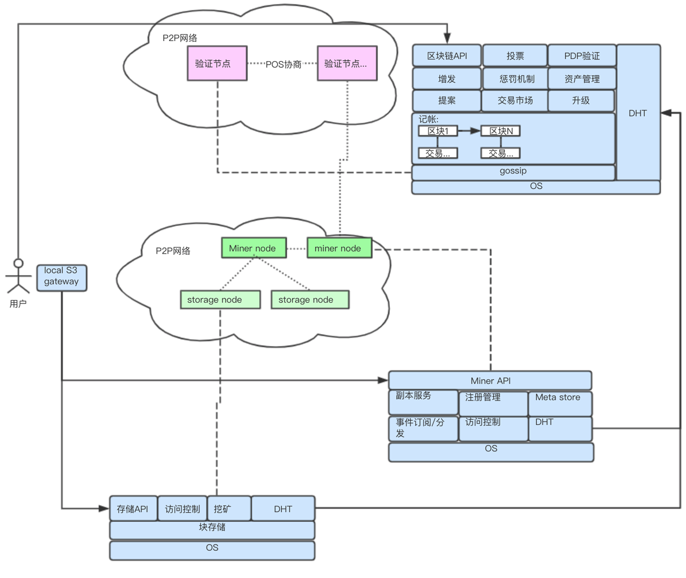
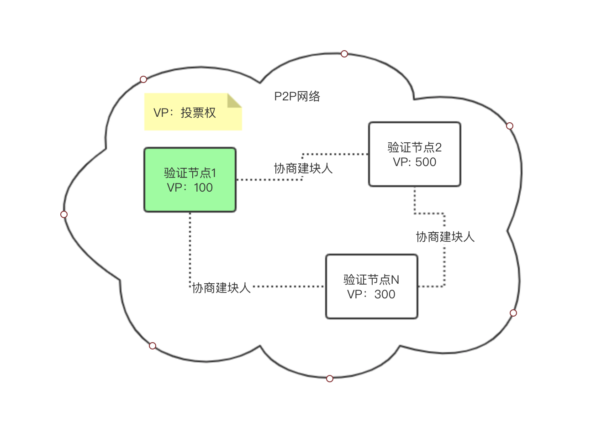
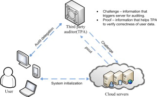
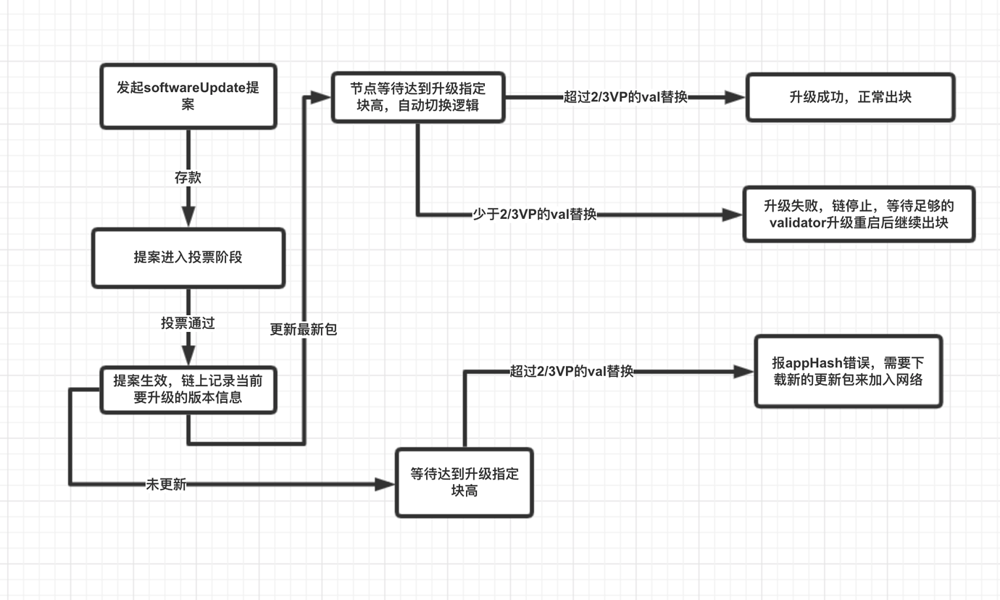
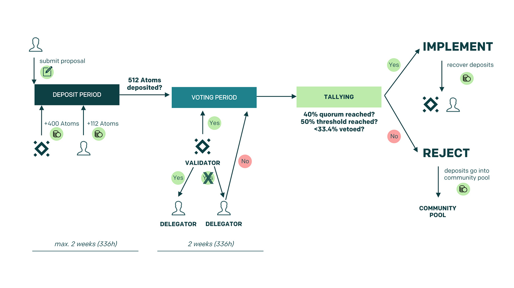
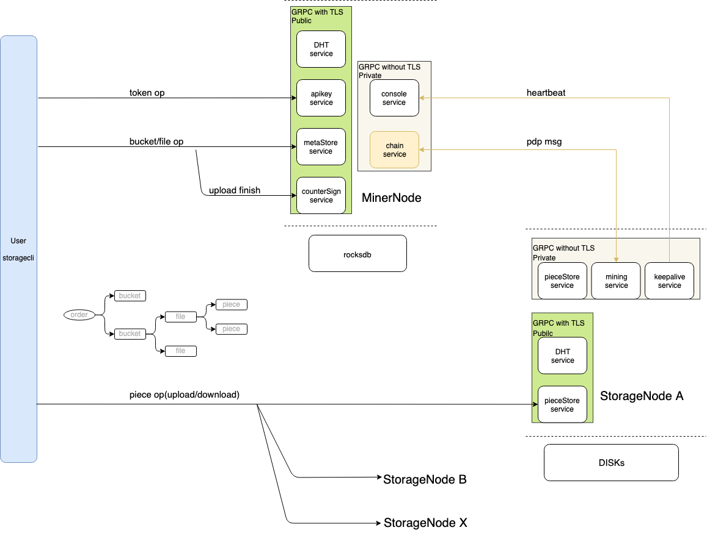
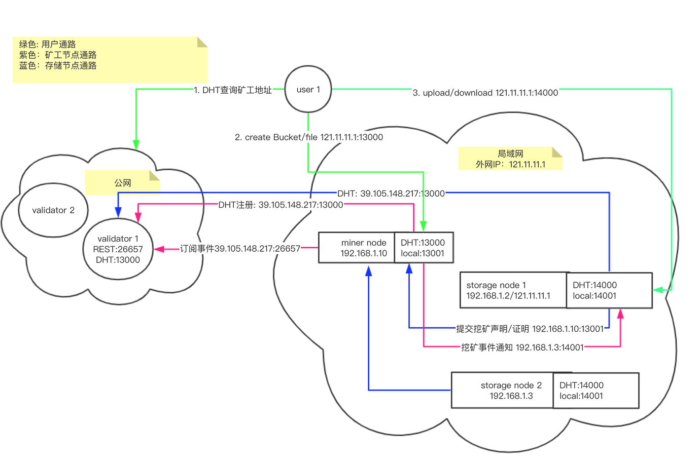
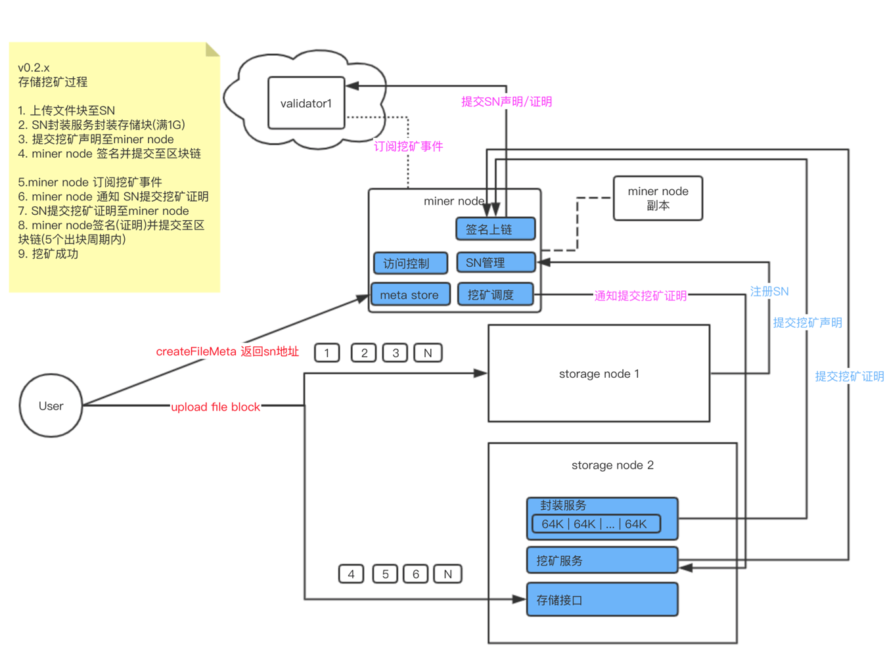

## Lambda 技术架构 

### 区块链

#### **技术架构图**




#### **共识机制**




Lambda区块链使用PoS共识区别于PoW共识。Pow协议参与门槛很低，但是想获得奖励就会比较困难，参与人里只能有一个算出个特别难的结果。 PoS协议是参与门槛比较高，获得奖励会比较容易。

验证节点负责在Lambda区块链建块维护区块链的帐本从而获得出块奖励，区块链最大支持100个验证节点。成为验证节点需要质押一定量的TBB，普通矿工和用户可以质押给验证节点，在区块链中拥有的质押量越多则建块的概率越高获得的出块奖励越多。

绿色的节点是第1个建块节点。首先验证节点们协商出来一位有权利进行建块的验证节点负责建块，建块人会获得一部分出块的奖励，其他验证节点对该块进行投票会获得投票的奖励。建块验证节点出块成功以后会再次协商出下一个建块的验证节点，并由下一个验证节点来进行建块。

#### **惩罚机制**

PoS协议中验证节点负责维护区块链帐本，验证节点决定了区块链的稳定性，如果验证节点投票不积极，最近的10000个块内500次未对区块投票就会被踢出共识网络，10分钟后可以重新申请加入，如果验证节点恶意双签区块，将永久踢出共识网络。

#### **POST 验证**

- 核心公式


- 核心流程（细节阐释请参考[论文](https://doi.org/10.1109/TC.2011.245) 3.4 节)



*(a)* 用户为待外包的每块数据生成一个 tag，这个 tag 是经由用户签名的；

*(b)* Validator 随机地对用户外包数据中的一块发起 challenge，这个 challenge 中包含由 TPA 生成的随机数；

*(c)* 存储矿工根据被挑战的数据块内容、tag 信息、challenge 信息以及自己生成的一个随机数计算得到一个 proof；

*(d)* Validator 以 challenge、proof 及用户公钥为参数，通过映射函数 的双线性性质检验存储矿工是否持有数据。

#### **交易市场**

- 交易市场是打通区块链与存储业务的核心服务组件
- 参与主体：存储做市商、矿工、用户

#### **存储做市商**

- 质押一定数量的LAMB成为存储做市商
- 做市商可以设置成单佣金、挂单手续费
- 做市商可以提取该市场收益

#### **矿工**

- 矿工挂空间卖单普通卖单、优质卖单，都需要押赔付金

  ```
      卖单单位：单价/GB/月
  
      普通卖单：市场随机匹配，固定单价， 赔付比率=0.5倍赔率
  
      优质卖单：可被指定购买，可自己定价，赔付比率1倍赔率，
  ```

- 赔付金，按使用时长线性提取回矿工帐户

- 获得的订单收益，按使用时长线性可提取回矿工帐户

- 矿工挂的卖单有长久有效期

- 矿工可以取消未被区配的卖单

- 矿工不能取消已经成交的订

- 矿工出售空间应大于最小出售单位，且是最小出售单位的整数倍

#### **用户**

- 买单单位：GB/月
- 用户需要挂买单购买空间
- 买单只有一个区块的有效期，发起购买只能成功/失败
- 用户不能取消已经成交的订单
- 用户购买空间应大于最小购买单位，且是最小购买单位的整数倍

#### **匹配规则**

- 增加匹配队列，按卖单发起时间进入区配队列，为匹配队列设置队列指针
- 随机匹配时根据上一区块快照的卖单与当前区块的买单为成交单集合
- 根据GB/时间，以队列指针方向顺序查询符合卖单，并移动队列指针

#### **平滑升级**

链的升级属于整个社区的行为，所以我们需要通过提案来作为链升级发起动作  

流程：

1. 用户发起一笔提案，子提案类型为`SoftwareUpgradeProposal`，提案携带需要升级的完整内容，完整内容需要包括如下: 新的版本号，版本切换的块高，新版本的代码分支链接（如果是未开源前应该为release package版本链接)，版本切换的阀值(只有当足够的validator更新了最新的package才去做版本切换)。
2. 社区对提案进行存款，投票，一旦通过，所有的validator和同步节点应该下载指定升级的版本运行包并且重启运行。
3. 到达设定的升级块高后，自动切换新的版本运行逻辑。




#### **出块奖励分配**

主网年化增发率为3.5%，出块时间为7秒左右，每块产生30LAMB，每年产出2亿LAMB

出块奖励分配比例：5% + 50% + 43% + 2%

1. 建块验证节点：1%～5%(当前块投票越多收益越多)，如少于5%部分的收益加给质押用户
2. 社区帐户：2%
3. 质押用户：
   50% 出块奖励给质押者(验证节点、矿工、用户).
   验证节点收取该节点矿工质押的一定比例的佣金抽成
4. 矿工：
   43% 出块奖励给提交挖矿证明的10名矿工
   建块验证节点收取打包挖矿证明的5%手续费
   矿工未提交挖矿证明，该矿工挖矿奖励打入销毁池

#### **链上发布资产**

lambda区块链有两种资产：TBB、LAMB

另外用户可以在lambda区块链发行自己的数字资产

- TBB
  - 用于存储资源质押
  - 1TBB代表1TB的存储
  - 通过质押TBB可以获得LAMB的增发收益
- LAMB
  - 主链的增发资产
- 发行数字资产
  - 用户可以质押100万LAMB发行一个数字资产
  - 发布资产的帐户地址拥有资产的初始总量
  - 发布资人在资产未流通时可以销毁该资产，销毁需要支付手续费
  - 资产可以进行转帐
  - 资产持有者可以进行锁定/解锁
  - 资产发行人可以进行增发
  - 资产持有者可以进行销毁

### 社区治理

#### **提按流程**

1. 任意用户可以作为提案人发起一笔提案proposal
2. 存款阶段，在14天内，需要对提案存够10000lamb的token，所有人都可以对该提案存款
3. 存款阶段，如果存款不够，则提案失效，所有已存的lamb被销毁
4. 满足存款条件的提案会进入投票阶段，投票阶段为14天
5. 满足如下所有条件的提案被认为是通过，且所有存款返回到存钱的账户
6. 质押人包括验证节点，矿工，合伙人节点和投票人
7. 当前的销毁lamb逻辑并不会影响lamb的总量，而是把币转给了一个系统账户`BurnedDepositCoinsAccAddr`

#### **在14天内：**

- 至少占全网总质押量40%的质押人对提案进行投票
- 少于33.4%的投票人投了veto(强烈反对)
- 大于50%的投票投了通过(去掉投abstain(弃权)部分的投票)
- 其他任意情况的投票结果被视为失败，所有的存款会被烧掉

#### **提案流程图**




### 存储

#### **技术架构图**




#### **网络架构图**




#### **数据安全**

- 使用Reed-solomon算法保证文件本身的数据安全

比如，一个矿工节点连接8个存储节点，矿工节点提供了1.5倍的冗余参数设置。用户将一份100MB的文件存到矿工，可以将该文件分成8个小的数据文件块来存储在不同的存储节点上。使用Reed-solomon算法，我只需要下载6份文件，就可以将这个100MB的文件恢复回来，允许有两个存储服务的数据丢失。

- 使用POST算法保证矿工有效存储了用户数据

#### **挖矿机制**




#### **矿池管理**

- Lambda 在物理形态上存在两个应用进程分别是Minernode(矿工节点)和Storagenode(存储节点)。

**Storagenode负责**

- 提供存储服务
- 进行存储挖矿

**Minernode负责**

- 管理Storagenode的注册并组建存储矿池
- 对存储订单进行空间分配
- 对用户分发访问令牌
- 负责路由Storagenode提交的挖矿证明

#### 兼容S3接口

Lambda存储在在用户接口层实现了兼容AWS S3的接口标准，使用S3存储接口标准的用户可以平滑的过度至Lambda存储。

### 如何挖矿

在Lambda区块链挖矿分为质押挖矿和存储挖矿，其中参与质押挖矿简单、参与存储挖矿复杂。

#### **质押挖矿**

- 购买TBB并质押到验证节点

#### **存储挖矿**

存储挖矿的五步骤

- 有一台存储矿工(有公网IP)
- 有足够大的磁盘
- 有效的数据存储。（不能说别人购买你的空间了，但是没有存数据这是不行的，需要有真实有效的数据存储。）
- 把有效存储进行数据封装，生成存储算力。
- 有存储算力后，就可以提交存储证明瓜分出块奖励。

