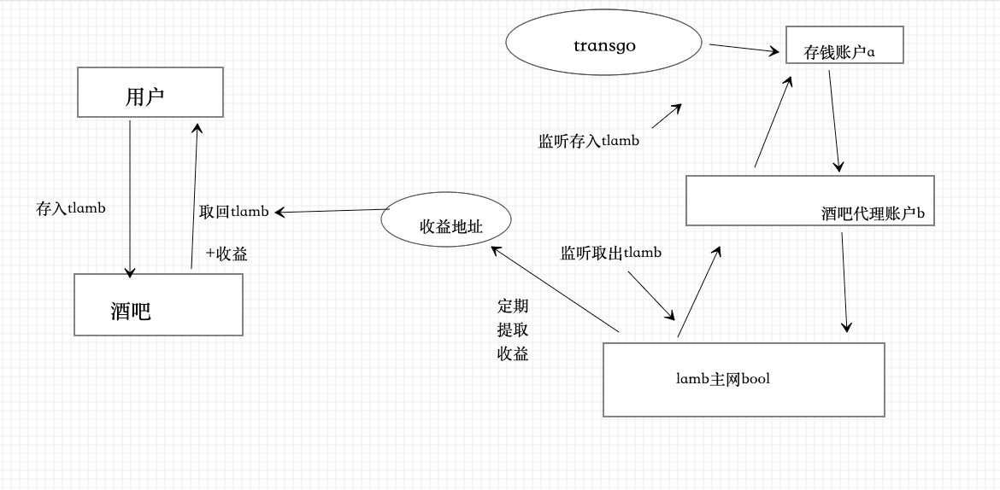

# 背景

激励LAMB持币用户参与存储挖矿，获得主网存储挖矿收益。

矿工与质押用户合作挖矿，将一定的收益分给质押者。

# 角色

## 准备金市场

    1. 收取用户提取收益手续费
    2. 收取矿工存储声明手续费
## 收益池

    1. 矿工收益池
    2. 用户收益池
## 准备金用户

    1. 将LAMB出借至准备金市场
    2. 从用户收益池提取准备金收益
    3. 用户可按数量退出准备金池(TG Forming需求)
## 矿工

    1. 向准备金市场声明存储挖矿容量
    2. 从矿工收益池提取收益
# 业务流程

1. 市场受益人创建初始准备金市场
    1. 用户受益人可提取市场手续费
2. 用户存币至准备金市场
    1. 为防止恶意刷交易，设置最小存币限额
3. 矿工声明存储容量至准备金市场，并支付一定的手续费
    1. 手续费率1%，一部分分给借贷市场受益人，一部分分给出借用户收益池
4. 市场为矿工创建一笔交易成单，用于存储挖矿
5. 矿工提交算力后，正常提交存储证明获得存储挖矿收益。
6. 矿工收益部分打入矿工收益池，根据线性释放规则线性提取
    1. 线性提取时间，每月释放10%。
7. 用户收益打入用户收益池，可随时提取
## 经济模式

*借贷市场的收益来源于存储挖矿产出的LAMB，且矿工借贷的lamb只能用于挖矿。*

## 收益计算

准备金池总量：M LAMB

该市场有效算力：N GB

单位算力借贷额：P （LAMB/GB）

该市场挖矿总产出：S LAMB

有效借贷：Q = P*N

出借人总收益：S* (Q / (M + Q))

矿工收益为：   S* (M  / (M + Q))

### 举例

准备金池总量 M=1000 LAMB

该市场有效算力：N=50 GB

单位算力借贷额 P=10 LAMB/GB

该市场挖矿总产出 S=200 LAMB

有效借贷：Q = P*N =500 LAMB

出借人总收益 = S * (Q  / (M + Q))  = 200 * (500  / (1000 + 50*10)) = 66.67 LAMB

矿工总收益    = S * (M   / (M + Q )) = 200 * (1000 / (1000 + 50*10)) = 133.33 LAMB

### 说明

根据公式可以看出，M > Q 的前提条件下，开始一段时间矿工的挖矿收益比较大，随着借贷矿工越来越多，Q 趋近于 M 的值，这时候借贷池的挖矿收益双方比例趋近于1:1。如果  Q>M，则收益率偏向出借方，理论上会有更多的人加入出借方。如果出借方 M 总量为0，挖矿产出的LAMB 全部归到借出收益池中。

# TG与借贷补充需求

## 角色

TLAMB用户

* 持有TLAMB用户可参与TG平台的Farming质押挖矿
* 已质押TLAMB用户随时可取消Farming质押挖矿

Farming合约

* *Fork Sushi swap Farming 单币种质押挖矿合约*
* 收益来源于另一地址的帐户余额，根据此数据源计算收益率

TG 平台

* 监听Farming合约质押交易，并对应质押进借贷池赚取收益
* 监听Farming提取取回质押，并对应取回相同的数量
* 定期将借贷池产出的挖矿收益打入Farming合约的收益地址
## 业务流程图

## 对帐

保证FORMING池数量与代理帐户存入池数量平帐

